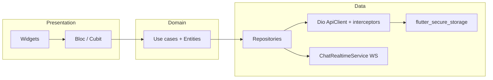

# Architecture — Nook Mobile

## Tổng quan



App giữ DTO hiện có trong `lib/data/models` (không Freezed). Logic màn hình chuyển dần sang Bloc; repository gọi be-blog / messaging qua Dio.

## Cấu trúc thư mục

```
lib/
  app/                    # MobileApp root
  core/
    auth/                 # TokenStore, SessionEvents
    config/               # AppConfig (dart-define)
    network/              # ApiClient, BeBlogHttp, parsers
    router/               # GoRouter + AppRoutes
    theme/, widgets/, …
  data/
    auth/, messaging/, models/, repositories/
  features/
    <name>/
      presentation/bloc/
      screens/
      widgets/
```

## Luồng dữ liệu

1. Widget `dispatch` event → Bloc.
2. Bloc gọi repository (hoặc AuthRepository).
3. Repository dùng `BeBlogHttp` / `MessagingApi` → `ApiClient` (Dio).
4. Interceptor gắn Bearer từ `TokenStore`; 401 → `SessionEvents.notifySessionExpired()`.
5. `AuthBloc` lắng nghe → clear session → GoRouter redirect `/login`.

## Auth

| State | Ý nghĩa |
|---|---|
| `unknown` | Splash đang khôi phục JWT |
| `authenticated` | Có token + profile (hoặc token khi mất mạng lúc mở app) |
| `unauthenticated` | Chưa đăng nhập / hết hạn |

Không có refresh token — hết hạn = đăng nhập lại.

## Điều hướng

`GoRouter` (`lib/core/router/app_router.dart`):

- Public: `/login`, `/register`, `/forgot-password`, `/reset-password`
- Shell tabs: `/home`, `/search`, `/library`, `/me` → `MainShell` + `IndexedStack`
- Detail: `/posts/:id`, `/reviews/:id`, `/users/:id`
- Tools: `/messages`, `/notifications`, `/friends`, `/saved`, `/notes`, `/calendar`

Redirect theo `AuthBloc.status` qua `refreshListenable`.

## Chat

Một stack: `features/messages` + `MessagingApi` + `ChatRealtimeService` + `CallController`.

- REST messaging-service qua Dio
- WS ticket một lần (`POST /api/chat/ws-ticket`)
- `ConversationsBloc` quản lý danh sách; `ChatScreen` vẫn stateful cho UX realtime dày
- Gọi thoại/video: `flutter_webrtc`, ICE từ `GET /api/chat/config`, signaling `call.*` qua WS + poll `/api/chat/call-signals`

## Pomodoro

`PomodoroTimerController` (singleton) + `PomodoroFloatingTimer` trong `MobileApp` builder — ẩn khi đang ở `/calendar`.

Stack cũ `features/messaging` + `MessagingRepository` đã xóa.

## State management chính

| Bloc | Phạm vi |
|---|---|
| `AuthBloc` | Toàn app |
| `NotificationsBloc` | Badge + list |
| `FeedBloc` | Home timeline |
| `CreatePostBloc` / `PostDetailBloc` | Posts |
| `ConversationsBloc` | Messages list |
| `LikesBloc` / `CommentsBloc` / `BookmarksBloc` | Social |
| `SearchBloc` | Search debounce + filter |
| `SettingsBloc` | Theme / font (persist SharedPreferences) |

## Bảo mật

- JWT trong Keychain / EncryptedSharedPreferences
- Log Dio chỉ method + path (không body/token)
- Cleartext Android tắt; network security config riêng cho LAN khi cần
